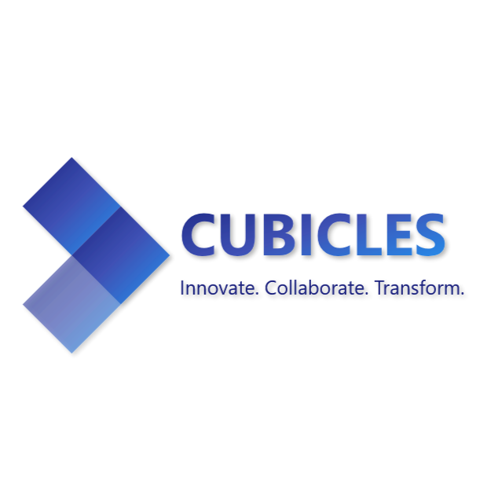

# **Cubicles: Hands-on Project Development for Students**  

### **Empowering AIML Students with Real-World Project Development**  

**Cubicles** is a structured initiative designed to bridge the gap between academic learning and industry-ready skills. Through hands-on projects in **Web Development, Mobile Applications, Machine Learning, and Artificial Intelligence**, students gain technical expertise, teamwork experience, and real-world problem-solving abilities.  

---

## 🔹 **Why Cubicles?**  

✔ **Industry-Aligned Learning** – Work on real-world problems with modern tools and frameworks.  
✔ **Structured Program** – Beginner, Intermediate, and Advanced project levels tailored to different expertise.  
✔ **Mentorship & Training** – Guided learning with technical mentorship from experts.  
✔ **Portfolio Development** – Showcase projects that enhance job and internship opportunities.  

---

## 📌 **Program at a Glance**  

- 🎯 **Duration:** 50-75 Days  
- 🚀 **Domains Covered:**  
  - Web Development  
  - Mobile App Development  
  - Machine Learning  
  - Artificial Intelligence  
- 💼 **Project Types:**  
  - Individual (Beginner)  
  - Duo (Intermediate)  
  - Team-based (Pro Level)  
- 💡 **Outcome:** Industry-ready skills, project experience, and a portfolio boost  

---

## 📢 **Get Involved**  

🚀 **Interested in joining or partnering?** We’re open to collaborations, mentorship, and sponsorships!  
📩 **Contact:** contact@cubicl3s.live  

🔗 **Stay Connected:**  
- 🟣 [GitHub](https://github.com/Cubicl3s)  
- 🟠 [Website](https://www.cubicl3s.live/)  
